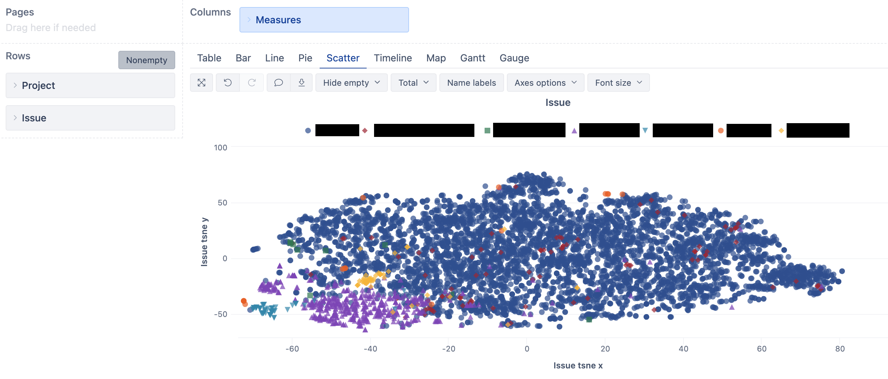
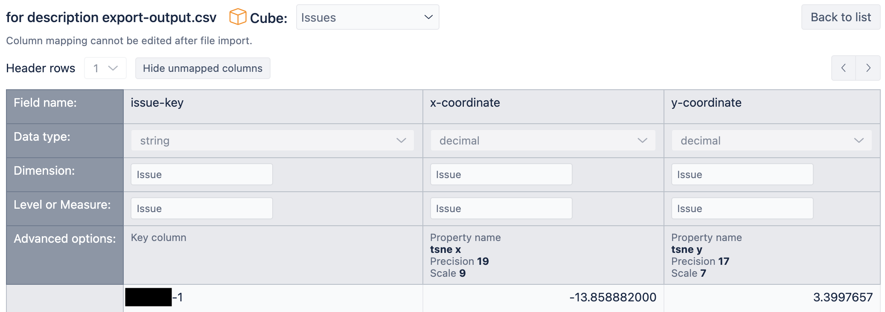

# Jira Issue Description Scatterplot Using eazyBI

## Abstract

Text embeddings are a type of applied AI. The embeddings take a word/sentence/paragraph as a source and convert it to multidimensional numerical array which represents its meaning. As meanings are represented as vectors, it is possible to calculate which of them mean similar things by evaluating Euclidian distance between the vectors. This also allows to use dimension reduction techniques to map vectors with hundreds of dimensions down to 2D while partially preserving spatial clustering information encoded in them.

### What this repository does

This guide provides a step-by-step approach to creating a scatterplot in eazyBI for Jira Cloud using Jira issue summary and description text. The scatterplot allows for visual representation of the relationships between issue descriptions, enabling the utilization of eazyBI's powerful analytics capabilities.

#### These are the general steps in this guide:

- Import the Jira issue description data into eazyBI. eazyBI does not do it by default.
- Export a CSV file containing the issue descriptions.
- Calculate text embedding vectors for the descriptions and reduce the vectors to two dimensions. Done by a Python script.
- Import the results back into eazyBI.

#### Example
The scatterplot below reveals clusters of issue meanings, and you can overlay different colors to represent various projects or other dimensions. These meaning clusters often correspond to other filtering mechanisms in a well-organized Jira, such as labels or components. By examining the scatterplot, you can observe patterns: teal project stands out as distinct, the purple project exhibits two distinct types of issue texts, the red project has diverse text patterns with some overlap with the blue project, and the blue project contains sub-clusters indicating similar themes.



Within eazyBI, you can interact with the scatterplot by mouse-overing points to view the corresponding issue summaries and assess the plot's quality.

By using embeddings, you can leverage the existing data in eazyBI to analyze Jira issues in a novel visual way and gain additional insight into issue relationships.


### Caveats

- The embedding model used here is a pretty old and with limited input length. Newer models may be better, but may require use of API. If you use those, check policies of API provider and your company to see if sending them full text of your Jira issues is ok.
- Calculating embeddings for 6000 issues took 2 minutes on a powerful PC. tSNE algorithm for dimensionality reduction scales as O(n^2) from issue count, which means that twice larger data set takes 4 times as long to process. Your computer likely can't calculate results for 100k data points.

## Prerequisites

Before proceeding, make sure you have the following:

- Access to Jira and eazyBI
- Python installed on your machine and the following Python libraries:
  - `pandas` - for CSV file manipulation
  - `scikit-learn` - for implementation of tSNE algorithm
  - `numpy` - basic library for matrix calculations
  - `langchain` - for text embeddings interface
- Install them with

  ``` shell
  pip install pandas scikit-learn numpy langchain
  ```

## Steps

### 1. Import Issue Data into eazyBI

To start, you need to import the issue data, including the summary and description, into eazyBI. This can be done by creating a calculated custom field in eazyBI that combines the summary and description fields. Description field import inspiration from here - https://community.eazybi.com/t/description-in-the-jira-import/286/12

#### 1.1 In the Jira import options Custom fields tab add new calculated custom field

- Internal name - `description`
- Display name - `description`
- Data type - `text`
- Additional advanced settings - `json_fields = ["description"]`
- Custom JavaScript code -

  ``` javascript
  text = "";
  if (issue.fields.summary) {
    text = text + issue.fields.summary + ".";
  }
  if (issue.fields.description) {
    text = text + " " + issue.fields.description;
  }
  return text;
  ```

#### 1.2 Add field to import
Check the "property" checkbox for the newly created custom field and click "Import"

### 2. Make a CSV file with issue keys + descriptions.
  Do a CSV file export from this report. Be careful with resulting file as it contains all issue descriptions from your imported data which may be sensitive.

  ``` json
    {
    "cube_name": "Issues",
    "cube_reports": [ {
      "name": "For description export",
      "result_view": "table",
      "definition": {"columns":{"dimensions":[{"name":"Measures","selected_set":["[Measures].[Issue description]"],"members":[]}]},"rows":{"dimensions":[{"name":"Issue","selected_set":["[Issue].[Issue].Members"],"members":[],"bookmarked_members":[]}],"nonempty_crossjoin":true},"pages":{"dimensions":[]},"options":{},"view":{"current":"table","maximized":false,"table":{"show_key":["Issue"]}},"calculated_members":[]}
    } ],
    "calculated_members": [{"name":"Issue description","dimension":"Measures","formula":"[Issue].CurrentHierarchyMember.get('description')","format_string":""}]
    }
  ```

### 3. Process Data in Python

Next, you will process the exported CSV file in Python to calculate text embedding vectors and reduce them to two dimensions. Assuming that the exported CSV data is in file for description export.csv, use the Python script from this repository and call it from command line:

  ``` shell
  python issue_scatterplot.py "for description export.csv"
  ```

For ~6000 issues the script ran ~2 minutes on my computer. Will take longer on first run, as it will download the model weights from HuggingFace repository. This will screate a results file with the same name as the source CSV, but with `-output` appended.

### 4. Import processed data into Issues cube

Map issue key column from file to Issues dimension Issues level as key column. Map coordinates as properties for Issues dimension Issues level. Precision/Scale are the default values offered by eazyBI.



### 5. Use the new properties to create a scatterplot and see clustering by description meaning


### 6. Possible improvements/development

- tSNE dimensionality reduction algorithm has a perplexity parameter that affects clustering. Different values may bring out more global or more local structure - https://stats.stackexchange.com/questions/222912/how-to-determine-parameters-for-t-sne-for-reducing-dimensions
- Try UMAP (Uniform Manifold Approximation and Projection) dimensionality reduction algorithm instead of tSNE - https://stats.stackexchange.com/questions/402668/intuitive-explanation-of-how-umap-works-compared-to-t-sne
- I tried PCA (Principal Component Analysis), but it gave worse results. Looked like a scatterplot of random values.
- Use a different model to generate embeddings. This uses a 2 year old freely available model https://huggingface.co/sentence-transformers/all-MiniLM-L6-v2 that works on local machine. See LangChain wiki for more available embeddings models. OpenAI probably provide the best ones, but usage is only through cheap but no free API, and requires you to send the text data to OpenAI. See their usage policy to see if that is acceptable.
- Use this for other textual data. Confluence pages, ticket text from some customer support portal, news articles, tweets, etc.

### 7. Acknowledgements

Thanks to ChatGPT for advice.
